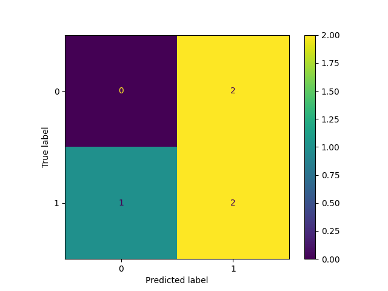
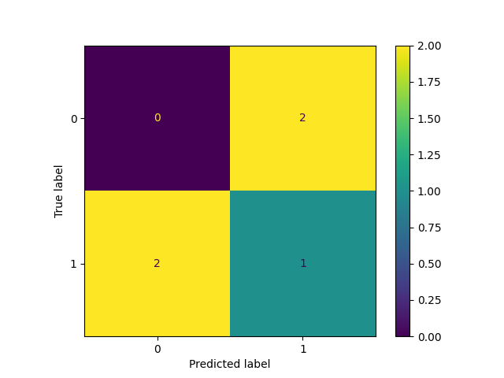

# Dynamic Risk Assessment System

Machine Learning DevOps Engineer Nanodegree Program
Project: A Dynamic Risk Assessment System

---

Installation Instructions

Uncompress the file “starter-file.zip”.

Install Conda: https://docs.conda.io/projects/conda/en/latest/user-guide/install/index.html 

Create a Conda Enviroment with Python 3.7
conda create -n MLDOE python=3.7
conda activate  MLDOE

Install the requirements:
pip install -r requirements.txt

---

File Structure

```
$ tree --dirsfirst
.
├── ingesteddata
│   ├── finaldata.csv
│   └── ingestedfiles.txt
├── models
│   ├── apireturns.txt
│   ├── confusionmatrix.png
│   ├── latestscore.txt
│   └── trainedmodel.pkl
├── practicedata
│   ├── dataset1.csv
│   └── dataset2.csv
├── practicemodels
│   ├── apireturns.txt
│   ├── confusionmatrix.png
│   ├── latestscore.txt
│   └── trainedmodel.pkl
├── production_deployment
│   ├── ingestedfiles.txt
│   ├── latestscore.txt
│   └── trainedmodel.pkl
├── sourcedata
│   ├── dataset3.csv
│   └── dataset4.csv
├── testdata
│   └── testdata.csv
├── apicalls.py
├── app.py
├── clear_results.py
├── config.json
├── config.json.backup1
├── config.json.backup2
├── crontab.file
├── deployment.py
├── diagnostics.py
├── execute_full_process_twice.sh
├── fullprocess.py
├── ingestion.py
├── reporting.py
├── REPORT.odt
├── REPORT.pdf
├── requirements.txt
├── scoring.py
├── training.py
├── use_configuration_1.sh
├── use_configuration_2.sh
└── wsgi.py

7 directories, 39 files
```

---

Example to Execute (with drift_must_improve_score = False)

Given that the practice model gives a better F1-score than the final model, it was necessary to tweak the Python script fullprocess.py in order to execute the final process twice and to obtain 2 confusion matrices and 2 apireturns.txt files:

```
drift_must_improve_score = False

def check_for_model_drift():
    score0 = scoring.read_f1_score(load_config()['prod_deployment_path'], 'latestscore.txt')
    print(f'score0={score0}')    
    os.system('python training.py')
    os.system('python scoring.py')
    score1 = scoring.read_f1_score(load_config()['output_model_path'], 'latestscore.txt')
    print(f'score0={score0}, score1={score1}')    
    return (score1 > score0) if drift_must_improve_score else abs(score1 - score0) > 0.001
```

In this first execution of execute_full_process_twice.sh, drift can be positive and negative, but not zero: (drift_must_improve_score = False) In the second execution of execute_full_process_twice.sh, drift can be only positive, greater than zero: (drift_must_improve_score = True)

Important Note: The Server Side (python app.py) must be executed before executing the script “execute_full_process_twice.sh”. Otherwise the RESTful API won’t be available.

```
$ ./execute_full_process_twice.sh 
===== EXECUTING execute_full_process_twice.sh =====
echo "===== EXECUTING execute_full_process_twice.sh ====="
cat execute_full_process_twice.sh
echo "===== EXECUTING python clear_results.py ====="
python clear_results.py
echo "===== EXECUTING python fullprocess.py (FOR THE FIRST TIME) ====="
python fullprocess.py
echo "===== EXECUTING ./use_configuration_2.sh ====="
./use_configuration_2.sh
echo "===== EXECUTING python fullprocess.py (FOR THE SECOND TIME) ====="
python fullprocess.py
===== EXECUTING python clear_results.py =====
===== EXECUTING python fullprocess.py (FOR THE FIRST TIME) =====
new_csv_files=['practicedata/dataset1.csv', 'practicedata/dataset2.csv']
---------------------------------------------------------
There are new CSV files. Running the script ingestion.py.
---------------------------------------------------------
===== RUNNING PYTHON SCRIPT ingestion.py =====
csv_files=['practicedata/dataset1.csv', 'practicedata/dataset2.csv']
practicedata/dataset1.csv
   corporation  lastmonth_activity  lastyear_activity  number_of_employees  exited
0         nciw                 100               1359                    1       0
1         lsid                  68                282                   14       0
2         pwls                  71                949                   40       1
3         bqlx                 686               3782                  103       0
4         zmei                  45                655                    7       0
5         wosl                   0                 18                   21       1
6         xcvb                 189                961                   18       1
7         dfgh                  16               1028                   33       0
8         ngrd                   9                 45                    1       1
9         xful                   0                 67                   14       1
10        kshe                  48                986                   22       1
11        qqqq                  52                650                   11       1
12        corp                1090               2452                    9       0
13        ekci                   6                 88                   90       1
14        dosk                  99                390                   99       1
15        endi                  75                800                   81       1
16        gudj                 255               1687                    2       0
practicedata/dataset2.csv
   corporation  lastmonth_activity  lastyear_activity  number_of_employees  exited
0         abcd                  78               1024                   12       1
1         asdf                  14               2145                   20       0
2         xyzz                 182               3891                   35       0
3         acme                 101              10983                    2       1
4         qwer                   0                118                   42       1
5         tyui                 929               1992                    1       0
6         zxcv                  19                455                    8       1
7         hjkl                  94                868                    3       1
8         lmno                  81               1401                   10       0
9         qqqq                  52                650                   11       1
10        corp                1090               2452                    9       0
11        ekci                   6                 88                   90       1
12        dosk                  99                390                   99       1
13        endi                  75                800                   81       1
14        gudj                 255               1687                    2       0
15        wosl                   0                 18                   21       1
16        xcvb                 189                961                   18       1
17        dfgh                  16               1028                   33       0
18        ngrd                   9                 45                    1       1
ingesteddata/finaldata.csv
   corporation  lastmonth_activity  lastyear_activity  number_of_employees  exited
0         nciw                 100               1359                    1       0
1         lsid                  68                282                   14       0
2         pwls                  71                949                   40       1
3         bqlx                 686               3782                  103       0
4         zmei                  45                655                    7       0
5         wosl                   0                 18                   21       1
6         xcvb                 189                961                   18       1
7         dfgh                  16               1028                   33       0
8         ngrd                   9                 45                    1       1
9         xful                   0                 67                   14       1
10        kshe                  48                986                   22       1
11        qqqq                  52                650                   11       1
12        corp                1090               2452                    9       0
13        ekci                   6                 88                   90       1
14        dosk                  99                390                   99       1
15        endi                  75                800                   81       1
16        gudj                 255               1687                    2       0
17        abcd                  78               1024                   12       1
18        asdf                  14               2145                   20       0
19        xyzz                 182               3891                   35       0
20        acme                 101              10983                    2       1
21        qwer                   0                118                   42       1
22        tyui                 929               1992                    1       0
23        zxcv                  19                455                    8       1
24        hjkl                  94                868                    3       1
25        lmno                  81               1401                   10       0
Record of ingestion was saved in file "ingesteddata/ingestedfiles.txt".
===== TESTING FOR DRIFT =====
score0=0.0
csv_file=ingesteddata/finaldata.csv
X=[[  100  1359     1]
 [   68   282    14]
 [   71   949    40]
 [  686  3782   103]
 [   45   655     7]
 [    0    18    21]
 [  189   961    18]
 [   16  1028    33]
 [    9    45     1]
 [    0    67    14]
 [   48   986    22]
 [   52   650    11]
 [ 1090  2452     9]
 [    6    88    90]
 [   99   390    99]
 [   75   800    81]
 [  255  1687     2]
 [   78  1024    12]
 [   14  2145    20]
 [  182  3891    35]
 [  101 10983     2]
 [    0   118    42]
 [  929  1992     1]
 [   19   455     8]
 [   94   868     3]
 [   81  1401    10]]
Y=[0 0 1 0 0 1 1 0 1 1 1 1 0 1 1 1 0 1 0 0 1 1 0 1 1 0]
Model was saved in the file "practicemodels/trainedmodel.pkl".
Test data loaded from file "testdata/testdata.csv".
X=[[  234     3    10]
 [   14  2145    99]
 [   34   333  1000]
 [  101 12346     2]
 [    0   675    25]]
Y=[1 0 0 1 1]
Model was loaded from file "practicemodels/trainedmodel.pkl".
f1 score: 0.5714285714285715
F1-score 0.5714285714285715 saved in file "practicemodels/latestscore.txt".
score0=0.0, score1=0.5714285714285715
---------------------------------------------------------------------------------
There is drift. Running the scripts deployment.py, apicalls.py, and reporting.py.
---------------------------------------------------------------------------------
===== RUNNING PYTHON SCRIPT deployment.py =====
File "practicemodels/trainedmodel.pkl" was successfully copied to "production_deployment".
File "practicemodels/latestscore.txt" was successfully copied to "production_deployment".
File "ingesteddata/ingestedfiles.txt" was successfully copied to "production_deployment".
===== RUNNING PYTHON SCRIPT apicalls.py =====
INPUT 1: {'location': 'testdata/testdata.csv'}
OUTPUT 1: {"predictions": [0, 1, 1, 1, 1]}
OUTPUT 2: {'f1_score': 0.5714285714285715}
OUTPUT 3: {'exited': {'mean': 0.5769230769230769, 'median': 1.0, 'stdev': 0.4940474068717357}, 'lastmonth_activity': {'mean': 165.65384615384616, 'median': 73.0, 'stdev': 278.5174959713127}, 'lastyear_activity': {'mean': 1502.923076923077, 'median': 955.0, 'stdev': 2150.065274913888}, 'number_of_employees': {'mean': 26.884615384615383, 'median': 14.0, 'stdev': 30.745014509018585}}
OUTPUT 4: {'na_percentages': [0.0, 0.0, 0.0, 0.0, 0.0], 'outdated_packages': {'Pillow': ['8.1.0', '8.1.0', '8.1.2'], 'pandas': ['1.2.2', '1.2.2', '1.2.3']}, 'times': [1.0436301231384277, 0.46016383171081543]}
The API returns were saved in file "practicemodels/apireturns.txt".
===== RUNNING PYTHON SCRIPT reporting.py =====
Test data loaded from file "testdata/testdata.csv".
X=[[  234     3    10]
 [   14  2145    99]
 [   34   333  1000]
 [  101 12346     2]
 [    0   675    25]]
Y=[1 0 0 1 1]
Predictions:
[0, 1, 1, 1, 1]
tn=0, fp=2, fn=1, tp=2
Confusion matrix plot saved to the file "practicemodels/confusionmatrix.png".
===== EXECUTING ./use_configuration_2.sh =====
===== EXECUTING python fullprocess.py (FOR THE SECOND TIME) =====
new_csv_files=['sourcedata/dataset3.csv', 'sourcedata/dataset4.csv']
---------------------------------------------------------
There are new CSV files. Running the script ingestion.py.
---------------------------------------------------------
===== RUNNING PYTHON SCRIPT ingestion.py =====
csv_files=['sourcedata/dataset3.csv', 'sourcedata/dataset4.csv']
sourcedata/dataset3.csv
   corporation  lastmonth_activity  lastyear_activity  number_of_employees  exited
0         nciw                  45                  0                   99       1
1         lsid                  36                234                  541       0
2         pwls                  23                555                   23       0
3         bqlx                  15                 11                  190       1
4         zmei                 100               2929                  999       1
5         wosl                   2                  1                 1359       0
6         xcvb                   0                 14                  282       1
7         dfgh                 500                 40                  949       0
8         ngrd                1234                103                 3782       1
9         xful               98765                  7                  655       0
10        kshe                  34               2345                   18       1
sourcedata/dataset4.csv
   corporation  lastmonth_activity  lastyear_activity  number_of_employees  exited
0         abcd                  99                871                    3       0
1         asdf                1243                  0                   10       0
2         xyzz                   0                 25                   11       1
3         acme                 813                129                    9       1
4         qwer                2989               9982                   90       0
5         tyui                 395                190                   99       0
6         zxcv               19028                999                   81       0
7         hjkl                 345                 78                    2       1
8         lmno                1024                 14                    3       1
9         qqqq                2145                182                  110       1
10        corp                3891                101                  998       0
11        ekci               10983                  0                 1200       0
12        dosk                 118                929                   81       1
13        endi                1992                 19                    2       0
14        gudj                 455                 94                  298       1
ingesteddata/finaldata.csv
   corporation  lastmonth_activity  lastyear_activity  number_of_employees  exited
0         nciw                  45                  0                   99       1
1         lsid                  36                234                  541       0
2         pwls                  23                555                   23       0
3         bqlx                  15                 11                  190       1
4         zmei                 100               2929                  999       1
5         wosl                   2                  1                 1359       0
6         xcvb                   0                 14                  282       1
7         dfgh                 500                 40                  949       0
8         ngrd                1234                103                 3782       1
9         xful               98765                  7                  655       0
10        kshe                  34               2345                   18       1
11        abcd                  99                871                    3       0
12        asdf                1243                  0                   10       0
13        xyzz                   0                 25                   11       1
14        acme                 813                129                    9       1
15        qwer                2989               9982                   90       0
16        tyui                 395                190                   99       0
17        zxcv               19028                999                   81       0
18        hjkl                 345                 78                    2       1
19        lmno                1024                 14                    3       1
20        qqqq                2145                182                  110       1
21        corp                3891                101                  998       0
22        ekci               10983                  0                 1200       0
23        dosk                 118                929                   81       1
24        endi                1992                 19                    2       0
25        gudj                 455                 94                  298       1
Record of ingestion was saved in file "ingesteddata/ingestedfiles.txt".
===== TESTING FOR DRIFT =====
score0=0.5714285714285715
csv_file=ingesteddata/finaldata.csv
X=[[   45     0    99]
 [   36   234   541]
 [   23   555    23]
 [   15    11   190]
 [  100  2929   999]
 [    2     1  1359]
 [    0    14   282]
 [  500    40   949]
 [ 1234   103  3782]
 [98765     7   655]
 [   34  2345    18]
 [   99   871     3]
 [ 1243     0    10]
 [    0    25    11]
 [  813   129     9]
 [ 2989  9982    90]
 [  395   190    99]
 [19028   999    81]
 [  345    78     2]
 [ 1024    14     3]
 [ 2145   182   110]
 [ 3891   101   998]
 [10983     0  1200]
 [  118   929    81]
 [ 1992    19     2]
 [  455    94   298]]
Y=[1 0 0 1 1 0 1 0 1 0 1 0 0 1 1 0 0 0 1 1 1 0 0 1 0 1]
Model was saved in the file "models/trainedmodel.pkl".
Test data loaded from file "testdata/testdata.csv".
X=[[  234     3    10]
 [   14  2145    99]
 [   34   333  1000]
 [  101 12346     2]
 [    0   675    25]]
Y=[1 0 0 1 1]
Model was loaded from file "models/trainedmodel.pkl".
f1 score: 0.3333333333333333
F1-score 0.3333333333333333 saved in file "models/latestscore.txt".
score0=0.5714285714285715, score1=0.3333333333333333
---------------------------------------------------------------------------------
There is drift. Running the scripts deployment.py, apicalls.py, and reporting.py.
---------------------------------------------------------------------------------
===== RUNNING PYTHON SCRIPT deployment.py =====
File "models/trainedmodel.pkl" was successfully copied to "production_deployment".
File "models/latestscore.txt" was successfully copied to "production_deployment".
File "ingesteddata/ingestedfiles.txt" was successfully copied to "production_deployment".
===== RUNNING PYTHON SCRIPT apicalls.py =====
INPUT 1: {'location': 'testdata/testdata.csv'}
OUTPUT 1: {"predictions": [0, 1, 1, 0, 1]}
OUTPUT 2: {'f1_score': 0.3333333333333333}
OUTPUT 3: {'exited': {'mean': 0.5, 'median': 0.5, 'stdev': 0.5}, 'lastmonth_activity': {'mean': 5625.923076923077, 'median': 425.0, 'stdev': 19067.170236829497}, 'lastyear_activity': {'mean': 763.5384615384615, 'median': 97.5, 'stdev': 1977.4481658240022}, 'number_of_employees': {'mean': 457.46153846153845, 'median': 99.0, 'stdev': 785.0576280057029}}
OUTPUT 4: {'na_percentages': [0.0, 0.0, 0.0, 0.0, 0.0], 'outdated_packages': {'Pillow': ['8.1.0', '8.1.0', '8.1.2'], 'pandas': ['1.2.2', '1.2.2', '1.2.3']}, 'times': [1.0206544399261475, 0.46021509170532227]}
The API returns were saved in file "models/apireturns.txt".
===== RUNNING PYTHON SCRIPT reporting.py =====
Test data loaded from file "testdata/testdata.csv".
X=[[  234     3    10]
 [   14  2145    99]
 [   34   333  1000]
 [  101 12346     2]
 [    0   675    25]]
Y=[1 0 0 1 1]
Predictions:
[0, 1, 1, 0, 1]
tn=0, fp=2, fn=2, tp=1
Confusion matrix plot saved to the file "models/confusionmatrix.png".
```

---

Server Side

```
$ python app.py 
 * Serving Flask app "app" (lazy loading)
 * Environment: production
   WARNING: This is a development server. Do not use it in a production deployment.
   Use a production WSGI server instead.
 * Debug mode: on
 * Running on http://0.0.0.0:8000/ (Press CTRL+C to quit)
 * Restarting with stat
 * Debugger is active!
 * Debugger PIN: 166-233-122
X=[[  234     3    10]
 [   14  2145    99]
 [   34   333  1000]
 [  101 12346     2]
 [    0   675    25]]
Y=[1 0 0 1 1]
127.0.0.1 - - [16/Mar/2021 05:27:00] "POST /prediction HTTP/1.1" 200 -
Test data loaded from file "testdata/testdata.csv".
X=[[  234     3    10]
 [   14  2145    99]
 [   34   333  1000]
 [  101 12346     2]
 [    0   675    25]]
Y=[1 0 0 1 1]
Model was loaded from file "practicemodels/trainedmodel.pkl".
f1 score: 0.5714285714285715
F1-score 0.5714285714285715 saved in file "practicemodels/latestscore.txt".
127.0.0.1 - - [16/Mar/2021 05:27:00] "GET /scoring HTTP/1.1" 200 -
Test data loaded from file "ingesteddata/finaldata.csv".
127.0.0.1 - - [16/Mar/2021 05:27:00] "GET /summarystats HTTP/1.1" 200 -
Test data loaded from file "ingesteddata/finaldata.csv".
WARNING: pip is being invoked by an old script wrapper. This will fail in a future version of pip.
Please see https://github.com/pypa/pip/issues/5599 for advice on fixing the underlying issue.
To avoid this problem you can invoke Python with '-m pip' instead of running pip directly.
WARNING: pip is being invoked by an old script wrapper. This will fail in a future version of pip.
Please see https://github.com/pypa/pip/issues/5599 for advice on fixing the underlying issue.
To avoid this problem you can invoke Python with '-m pip' instead of running pip directly.
127.0.0.1 - - [16/Mar/2021 05:27:11] "GET /diagnostics HTTP/1.1" 200 -
X=[[  234     3    10]
 [   14  2145    99]
 [   34   333  1000]
 [  101 12346     2]
 [    0   675    25]]
Y=[1 0 0 1 1]
127.0.0.1 - - [16/Mar/2021 05:27:19] "POST /prediction HTTP/1.1" 200 -
Test data loaded from file "testdata/testdata.csv".
X=[[  234     3    10]
 [   14  2145    99]
 [   34   333  1000]
 [  101 12346     2]
 [    0   675    25]]
Y=[1 0 0 1 1]
Model was loaded from file "models/trainedmodel.pkl".
f1 score: 0.3333333333333333
F1-score 0.3333333333333333 saved in file "models/latestscore.txt".
127.0.0.1 - - [16/Mar/2021 05:27:19] "GET /scoring HTTP/1.1" 200 -
Test data loaded from file "ingesteddata/finaldata.csv".
127.0.0.1 - - [16/Mar/2021 05:27:19] "GET /summarystats HTTP/1.1" 200 -
Test data loaded from file "ingesteddata/finaldata.csv".
WARNING: pip is being invoked by an old script wrapper. This will fail in a future version of pip.
Please see https://github.com/pypa/pip/issues/5599 for advice on fixing the underlying issue.
To avoid this problem you can invoke Python with '-m pip' instead of running pip directly.
WARNING: pip is being invoked by an old script wrapper. This will fail in a future version of pip.
Please see https://github.com/pypa/pip/issues/5599 for advice on fixing the underlying issue.
To avoid this problem you can invoke Python with '-m pip' instead of running pip directly.
127.0.0.1 - - [16/Mar/2021 05:27:30] "GET /diagnostics HTTP/1.1" 200 -
```

---

API Returns and Confusion Matrices



'f1_score': 0.5714285714285715



'f1_score': 0.3333333333333333

```
$ cat practicemodels/apireturns.txt 
INPUT 1: {'location': 'testdata/testdata.csv'}
OUTPUT 1: {"predictions": [0, 1, 1, 1, 1]}
OUTPUT 2: {'f1_score': 0.5714285714285715}
OUTPUT 3: {'exited': {'mean': 0.5769230769230769, 'median': 1.0, 'stdev': 0.4940474068717357}, 'lastmonth_activity': {'mean': 165.65384615384616, 'median': 73.0, 'stdev': 278.5174959713127}, 'lastyear_activity': {'mean': 1502.923076923077, 'median': 955.0, 'stdev': 2150.065274913888}, 'number_of_employees': {'mean': 26.884615384615383, 'median': 14.0, 'stdev': 30.745014509018585}}
OUTPUT 4: {'na_percentages': [0.0, 0.0, 0.0, 0.0, 0.0], 'outdated_packages': {'Pillow': ['8.1.0', '8.1.0', '8.1.2'], 'pandas': ['1.2.2', '1.2.2', '1.2.3']}, 'times': [1.0436301231384277, 0.46016383171081543]}
```

```
$ cat models/apireturns.txt 
INPUT 1: {'location': 'testdata/testdata.csv'}
OUTPUT 1: {"predictions": [0, 1, 1, 0, 1]}
OUTPUT 2: {'f1_score': 0.3333333333333333}
OUTPUT 3: {'exited': {'mean': 0.5, 'median': 0.5, 'stdev': 0.5}, 'lastmonth_activity': {'mean': 5625.923076923077, 'median': 425.0, 'stdev': 19067.170236829497}, 'lastyear_activity': {'mean': 763.5384615384615, 'median': 97.5, 'stdev': 1977.4481658240022}, 'number_of_employees': {'mean': 457.46153846153845, 'median': 99.0, 'stdev': 785.0576280057029}}
OUTPUT 4: {'na_percentages': [0.0, 0.0, 0.0, 0.0, 0.0], 'outdated_packages': {'Pillow': ['8.1.0', '8.1.0', '8.1.2'], 'pandas': ['1.2.2', '1.2.2', '1.2.3']}, 'times': [1.0206544399261475, 0.46021509170532227]}
```

---

Example to Execute (with drift_must_improve_score = True)

In the first execution of execute_full_process_twice.sh, drift could be positive and negative, but not zero: (drift_must_improve_score = False) In this second execution of execute_full_process_twice.sh, drift can be only positive, greater than zero: (drift_must_improve_score = True). As a result, only in the first execution of “python fullprocess.py”, drift is generated. And drift is not generated in the second execution of “python fullprocess.py”. In other words, there is only 1 apireturns.txt file and 1 confusion matrix, not 2 pairs.

```
drift_must_improve_score = True

def check_for_model_drift():
    score0 = scoring.read_f1_score(load_config()['prod_deployment_path'], 'latestscore.txt')
    print(f'score0={score0}')    
    os.system('python training.py')
    os.system('python scoring.py')
    score1 = scoring.read_f1_score(load_config()['output_model_path'], 'latestscore.txt')
    print(f'score0={score0}, score1={score1}')    
    return (score1 > score0) if drift_must_improve_score else abs(score1 - score0) > 0.001
```

```
$ ./execute_full_process_twice.sh 
===== EXECUTING execute_full_process_twice.sh =====
echo "===== EXECUTING execute_full_process_twice.sh ====="
cat execute_full_process_twice.sh
echo "===== EXECUTING python clear_results.py ====="
python clear_results.py
echo "===== EXECUTING python fullprocess.py (FOR THE FIRST TIME) ====="
python fullprocess.py
echo "===== EXECUTING ./use_configuration_2.sh ====="
./use_configuration_2.sh
echo "===== EXECUTING python fullprocess.py (FOR THE SECOND TIME) ====="
python fullprocess.py
===== EXECUTING python clear_results.py =====
===== EXECUTING python fullprocess.py (FOR THE FIRST TIME) =====
new_csv_files=['practicedata/dataset1.csv', 'practicedata/dataset2.csv']
---------------------------------------------------------
There are new CSV files. Running the script ingestion.py.
---------------------------------------------------------
===== RUNNING PYTHON SCRIPT ingestion.py =====
csv_files=['practicedata/dataset1.csv', 'practicedata/dataset2.csv']
practicedata/dataset1.csv
   corporation  lastmonth_activity  lastyear_activity  number_of_employees  exited
0         nciw                 100               1359                    1       0
1         lsid                  68                282                   14       0
2         pwls                  71                949                   40       1
3         bqlx                 686               3782                  103       0
4         zmei                  45                655                    7       0
5         wosl                   0                 18                   21       1
6         xcvb                 189                961                   18       1
7         dfgh                  16               1028                   33       0
8         ngrd                   9                 45                    1       1
9         xful                   0                 67                   14       1
10        kshe                  48                986                   22       1
11        qqqq                  52                650                   11       1
12        corp                1090               2452                    9       0
13        ekci                   6                 88                   90       1
14        dosk                  99                390                   99       1
15        endi                  75                800                   81       1
16        gudj                 255               1687                    2       0
practicedata/dataset2.csv
   corporation  lastmonth_activity  lastyear_activity  number_of_employees  exited
0         abcd                  78               1024                   12       1
1         asdf                  14               2145                   20       0
2         xyzz                 182               3891                   35       0
3         acme                 101              10983                    2       1
4         qwer                   0                118                   42       1
5         tyui                 929               1992                    1       0
6         zxcv                  19                455                    8       1
7         hjkl                  94                868                    3       1
8         lmno                  81               1401                   10       0
9         qqqq                  52                650                   11       1
10        corp                1090               2452                    9       0
11        ekci                   6                 88                   90       1
12        dosk                  99                390                   99       1
13        endi                  75                800                   81       1
14        gudj                 255               1687                    2       0
15        wosl                   0                 18                   21       1
16        xcvb                 189                961                   18       1
17        dfgh                  16               1028                   33       0
18        ngrd                   9                 45                    1       1
ingesteddata/finaldata.csv
   corporation  lastmonth_activity  lastyear_activity  number_of_employees  exited
0         nciw                 100               1359                    1       0
1         lsid                  68                282                   14       0
2         pwls                  71                949                   40       1
3         bqlx                 686               3782                  103       0
4         zmei                  45                655                    7       0
5         wosl                   0                 18                   21       1
6         xcvb                 189                961                   18       1
7         dfgh                  16               1028                   33       0
8         ngrd                   9                 45                    1       1
9         xful                   0                 67                   14       1
10        kshe                  48                986                   22       1
11        qqqq                  52                650                   11       1
12        corp                1090               2452                    9       0
13        ekci                   6                 88                   90       1
14        dosk                  99                390                   99       1
15        endi                  75                800                   81       1
16        gudj                 255               1687                    2       0
17        abcd                  78               1024                   12       1
18        asdf                  14               2145                   20       0
19        xyzz                 182               3891                   35       0
20        acme                 101              10983                    2       1
21        qwer                   0                118                   42       1
22        tyui                 929               1992                    1       0
23        zxcv                  19                455                    8       1
24        hjkl                  94                868                    3       1
25        lmno                  81               1401                   10       0
Record of ingestion was saved in file "ingesteddata/ingestedfiles.txt".
===== TESTING FOR DRIFT =====
score0=0.0
csv_file=ingesteddata/finaldata.csv
X=[[  100  1359     1]
 [   68   282    14]
 [   71   949    40]
 [  686  3782   103]
 [   45   655     7]
 [    0    18    21]
 [  189   961    18]
 [   16  1028    33]
 [    9    45     1]
 [    0    67    14]
 [   48   986    22]
 [   52   650    11]
 [ 1090  2452     9]
 [    6    88    90]
 [   99   390    99]
 [   75   800    81]
 [  255  1687     2]
 [   78  1024    12]
 [   14  2145    20]
 [  182  3891    35]
 [  101 10983     2]
 [    0   118    42]
 [  929  1992     1]
 [   19   455     8]
 [   94   868     3]
 [   81  1401    10]]
Y=[0 0 1 0 0 1 1 0 1 1 1 1 0 1 1 1 0 1 0 0 1 1 0 1 1 0]
Model was saved in the file "practicemodels/trainedmodel.pkl".
Test data loaded from file "testdata/testdata.csv".
X=[[  234     3    10]
 [   14  2145    99]
 [   34   333  1000]
 [  101 12346     2]
 [    0   675    25]]
Y=[1 0 0 1 1]
Model was loaded from file "practicemodels/trainedmodel.pkl".
f1 score: 0.5714285714285715
F1-score 0.5714285714285715 saved in file "practicemodels/latestscore.txt".
score0=0.0, score1=0.5714285714285715
---------------------------------------------------------------------------------
There is drift. Running the scripts deployment.py, apicalls.py, and reporting.py.
---------------------------------------------------------------------------------
===== RUNNING PYTHON SCRIPT deployment.py =====
File "practicemodels/trainedmodel.pkl" was successfully copied to "production_deployment".
File "practicemodels/latestscore.txt" was successfully copied to "production_deployment".
File "ingesteddata/ingestedfiles.txt" was successfully copied to "production_deployment".
===== RUNNING PYTHON SCRIPT apicalls.py =====
INPUT 1: {'location': 'testdata/testdata.csv'}
OUTPUT 1: {"predictions": [0, 1, 1, 1, 1]}
OUTPUT 2: {'f1_score': 0.5714285714285715}
OUTPUT 3: {'exited': {'mean': 0.5769230769230769, 'median': 1.0, 'stdev': 0.4940474068717357}, 'lastmonth_activity': {'mean': 165.65384615384616, 'median': 73.0, 'stdev': 278.5174959713127}, 'lastyear_activity': {'mean': 1502.923076923077, 'median': 955.0, 'stdev': 2150.065274913888}, 'number_of_employees': {'mean': 26.884615384615383, 'median': 14.0, 'stdev': 30.745014509018585}}
OUTPUT 4: {'na_percentages': [0.0, 0.0, 0.0, 0.0, 0.0], 'outdated_packages': {'Pillow': ['8.1.0', '8.1.0', '8.1.2'], 'pandas': ['1.2.2', '1.2.2', '1.2.3']}, 'times': [1.035158634185791, 0.4606971740722656]}
The API returns were saved in file "practicemodels/apireturns.txt".
===== RUNNING PYTHON SCRIPT reporting.py =====
Test data loaded from file "testdata/testdata.csv".
X=[[  234     3    10]
 [   14  2145    99]
 [   34   333  1000]
 [  101 12346     2]
 [    0   675    25]]
Y=[1 0 0 1 1]
Predictions:
[0, 1, 1, 1, 1]
tn=0, fp=2, fn=1, tp=2
Confusion matrix plot saved to the file "practicemodels/confusionmatrix.png".
===== EXECUTING ./use_configuration_2.sh =====
===== EXECUTING python fullprocess.py (FOR THE SECOND TIME) =====
new_csv_files=['sourcedata/dataset3.csv', 'sourcedata/dataset4.csv']
---------------------------------------------------------
There are new CSV files. Running the script ingestion.py.
---------------------------------------------------------
===== RUNNING PYTHON SCRIPT ingestion.py =====
csv_files=['sourcedata/dataset3.csv', 'sourcedata/dataset4.csv']
sourcedata/dataset3.csv
   corporation  lastmonth_activity  lastyear_activity  number_of_employees  exited
0         nciw                  45                  0                   99       1
1         lsid                  36                234                  541       0
2         pwls                  23                555                   23       0
3         bqlx                  15                 11                  190       1
4         zmei                 100               2929                  999       1
5         wosl                   2                  1                 1359       0
6         xcvb                   0                 14                  282       1
7         dfgh                 500                 40                  949       0
8         ngrd                1234                103                 3782       1
9         xful               98765                  7                  655       0
10        kshe                  34               2345                   18       1
sourcedata/dataset4.csv
   corporation  lastmonth_activity  lastyear_activity  number_of_employees  exited
0         abcd                  99                871                    3       0
1         asdf                1243                  0                   10       0
2         xyzz                   0                 25                   11       1
3         acme                 813                129                    9       1
4         qwer                2989               9982                   90       0
5         tyui                 395                190                   99       0
6         zxcv               19028                999                   81       0
7         hjkl                 345                 78                    2       1
8         lmno                1024                 14                    3       1
9         qqqq                2145                182                  110       1
10        corp                3891                101                  998       0
11        ekci               10983                  0                 1200       0
12        dosk                 118                929                   81       1
13        endi                1992                 19                    2       0
14        gudj                 455                 94                  298       1
ingesteddata/finaldata.csv
   corporation  lastmonth_activity  lastyear_activity  number_of_employees  exited
0         nciw                  45                  0                   99       1
1         lsid                  36                234                  541       0
2         pwls                  23                555                   23       0
3         bqlx                  15                 11                  190       1
4         zmei                 100               2929                  999       1
5         wosl                   2                  1                 1359       0
6         xcvb                   0                 14                  282       1
7         dfgh                 500                 40                  949       0
8         ngrd                1234                103                 3782       1
9         xful               98765                  7                  655       0
10        kshe                  34               2345                   18       1
11        abcd                  99                871                    3       0
12        asdf                1243                  0                   10       0
13        xyzz                   0                 25                   11       1
14        acme                 813                129                    9       1
15        qwer                2989               9982                   90       0
16        tyui                 395                190                   99       0
17        zxcv               19028                999                   81       0
18        hjkl                 345                 78                    2       1
19        lmno                1024                 14                    3       1
20        qqqq                2145                182                  110       1
21        corp                3891                101                  998       0
22        ekci               10983                  0                 1200       0
23        dosk                 118                929                   81       1
24        endi                1992                 19                    2       0
25        gudj                 455                 94                  298       1
Record of ingestion was saved in file "ingesteddata/ingestedfiles.txt".
===== TESTING FOR DRIFT =====
score0=0.5714285714285715
csv_file=ingesteddata/finaldata.csv
X=[[   45     0    99]
 [   36   234   541]
 [   23   555    23]
 [   15    11   190]
 [  100  2929   999]
 [    2     1  1359]
 [    0    14   282]
 [  500    40   949]
 [ 1234   103  3782]
 [98765     7   655]
 [   34  2345    18]
 [   99   871     3]
 [ 1243     0    10]
 [    0    25    11]
 [  813   129     9]
 [ 2989  9982    90]
 [  395   190    99]
 [19028   999    81]
 [  345    78     2]
 [ 1024    14     3]
 [ 2145   182   110]
 [ 3891   101   998]
 [10983     0  1200]
 [  118   929    81]
 [ 1992    19     2]
 [  455    94   298]]
Y=[1 0 0 1 1 0 1 0 1 0 1 0 0 1 1 0 0 0 1 1 1 0 0 1 0 1]
Model was saved in the file "models/trainedmodel.pkl".
Test data loaded from file "testdata/testdata.csv".
X=[[  234     3    10]
 [   14  2145    99]
 [   34   333  1000]
 [  101 12346     2]
 [    0   675    25]]
Y=[1 0 0 1 1]
Model was loaded from file "models/trainedmodel.pkl".
f1 score: 0.3333333333333333
F1-score 0.3333333333333333 saved in file "models/latestscore.txt".
score0=0.5714285714285715, score1=0.3333333333333333
There is no drift. Process ended.
```

---

